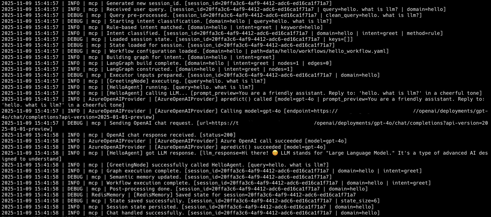

# 🧠 Multi-Agent Orchestration Framework  
*A declarative LangGraph-based framework for building multi-agent workflows*

[](LICENSE)
[](https://www.python.org/)
[](https://github.com/yx-fan/agent-flow-framework)
[](https://github.com/langchain-ai/langgraph)
[](https://fastapi.tiangolo.com/)
[]()

A plug-and-play **multi-agent orchestration framework** for developers building domain-specific AI systems with LangGraph — composable, declarative, and production-ready.

## 🏷️ Topics

`langgraph` `multi-agent` `llm` `ai-framework` `fastapi` `python` `orchestration` `yaml-config` `redis` `azure-openai` `agent-framework` `langchain` `workflow-engine` `conversational-ai` `state-management` `declarative` `modular` `production-ready`


---

## 🌍 Overview

**Multi-Agent Orchestration Framework**  
is a **developer-oriented orchestration framework** for building **multi-agent, multi-domain AI systems** powered by [LangGraph](https://github.com/langchain-ai/langgraph).

It provides a **structured, extensible runtime** for combining:
- 🧠 **Agents** (decision-makers powered by LLMs)
- 🔗 **Nodes** (graph-executable logic units)
- 🧰 **Tools** (external integrations)
- 💾 **Memory** (Redis-based short-term state)
- ⚙️ **Providers** (Azure OpenAI, etc.)

Together, they form **intelligent conversational workflows** defined declaratively via YAML —  
so developers can rapidly compose and extend domain-specific AI applications without reimplementing orchestration logic.

**Build modular, reasoning-driven AI systems — without writing orchestration code.**

---

## ✨ Why This Framework?

| Feature | Description |
|----------|--------------|
| 🧩 **Fully Modular** | Agents, Nodes, Tools, and Providers are decoupled and reusable. |
| 🧠 **Intent + Workflow System** | Combine `intents.yaml` and `workflow.yaml` to define complex multi-domain logic. |
| 🔄 **Node–Agent Hierarchy** | Nodes orchestrate, Agents decide — offering fine-grained control and LLM flexibility. |
| 💾 **Stateful Memory Layer** | Redis backend for short-term conversational memory and context recall. |
| 🚀 **LangGraph-Powered Runtime** | Build and execute dynamic computational graphs with full async support. |
| 🌐 **FastAPI Integration** | Out-of-the-box `/chat` endpoint ready for serving agents as microservices. |
| 🧭 **Extensible by Design** | Plug in your own domains, agents, or tools in minutes. |

---

## 🧱 Architecture Overview

```
+-----------------------------------------------------------+
|              🧠 Multi-Agent Orchestrator                   |
|-----------------------------------------------------------|
|  AgentRouter  |  LangGraphBuilder  |  StateManager        |
+-----------------------------------------------------------+
|             YAML-defined Domain Workflows                 |
|-----------------------------------------------------------|
|  Nodes → Agents → Tools → Providers → LLMs                |
|-----------------------------------------------------------|
|  Redis Memory  |  FastAPI API  |  Extensible Providers    |
+-----------------------------------------------------------+
```

This structure allows you to **design your own domain workflows**  
(e.g., `school`, `finance`, `support`) by simply defining intents and linking nodes/agents in YAML.

---

## 🧩 Execution Demo


> _Example: The framework orchestrating a full reasoning flow — from intent classification and LangGraph construction to AzureOpenAI inference and Redis state persistence._

---

## ⚙️ Installation

```bash
git clone https://github.com/yx-fan/agent-flow-framework.git
cd agent-flow-framework
pip install -r requirements.txt
cp .env.example .env
```

Then edit `.env` to configure Redis and Azure OpenAI (or your preferred provider if you update related code).

---

## 🚀 Quick Start

```bash
uvicorn main:app --host 0.0.0.0 --port 8001 --reload
```

Access the API at  
👉 http://127.0.0.1:8001/chat  

📚 **Interactive API Documentation**:  
- Swagger UI: http://127.0.0.1:8001/docs  
- ReDoc: http://127.0.0.1:8001/redoc  

#### Example:
```bash
curl -X POST "http://127.0.0.1:8001/chat"     
-H "Content-Type: application/json"
-d '{"query": "hello. what is llm?"}'
```

In the body, you can also specify a domain and additional session_id if needed:
```bash
-d '{"query": "hello. what is llm?", "domain": "hello", "session_id": 20ffa3c6-4af9-4412-adc6-ed16ca1f71a7"}'
```

#### Response:
```json
{
    "session_id": "20ffa3c6-4af9-4412-adc6-ed16ca1f71a7",
    "query": "hello",
    "domain": "hello",
    "result": {
        "domain": "hello",
        "intent": "greet",
        "result": {
            "query": "hello. what is llm?",
            "domain": "hello",
            "greeting": "Hello there 👋! Let me think about that for you...",
            "agent_reply": "👋 Hello! You said: 'hello. what is llm?'.\nLLM says: Hi there! 😊 LLM stands for \"Large Language Model.\" It's a type of advanced AI designed to understand and generate human-like text. Think of it as a virtual assistant or brainy language buddy that can help with everything from answering questions to creating stories! Did you want to know more about it? 😄",
            "timestamp": "2025-11-09T20:41:57.600949",
            "llm_used": true
        }
    }
}
```

✅ The framework dynamically loads the `hello` domain workflow →  
executes `GreetingNode` → calls `HelloAgent` → routes through `AzureOpenAIProvider`.

---

## 🧩 Domain Workflow Example

**`data/hello/intents.yaml`**
```yaml
intents:
  greet:
    description: Simple greetings and small talk.
    keywords: ["hello", "hi", "hey", "morning"]
```

**`data/hello/workflows/hello_workflow.yaml`**
```yaml
greet:
  nodes:
    - name: Greeting
      type: node
      class: GreetingNode
      agent: HelloAgent
  edges: []
```


This modular structure lets you **add new domains**  
by simply creating a folder like `data/school/` or `data/finance/`  
and defining custom `intents.yaml` + `workflow.yaml` files.

---

## 📂 Project Structure

agent-flow-framework/
├── core/                # Base abstractions & registry
├── orchestrator/        # LangGraph builder & orchestration logic
├── nodes/               # Domain-specific nodes
├── agents/              # Domain-specific agents
├── tools/               # External API / DB / function tools
├── data/                # Domain intents & workflows (YAML)
├── providers/           # LLM providers (AzureOpenAI, etc.)
├── memory/              # Memory interface & Redis implementation
├── api/                 # FastAPI endpoints
├── main.py              # FastAPI entrypoint
└── requirements.txt

---

## 🧠 Core Concepts

**Multi-Agent Orchestration Framework** consists of three layers — from low-level abstraction to runtime orchestration — each clearly separated and independently extensible.

| Layer | Role | Key Components | Purpose |
|-------|------|----------------|----------|
| 🧩 **Execution Layer** | Executes business and cognitive logic directly | `Node`, `Agent`, `Tool` | Executes domain rules and workflows, performs LLM reasoning, and interacts with external systems. |
| ⚙️ **Core Layer** | Provides foundational abstractions and common capabilities | `BaseAgent`, `BaseNode`, `BaseTool`, `Config`, `Logger`, `MemoryInterface`, `Registry`, `Exceptions` | Ensures unified lifecycle, structured logging, configuration management, memory abstraction, dynamic registration, and error modeling. |
| 🕹️ **Orchestration Layer** | Runtime orchestration and multi-domain routing | `LangGraphBuilder`, `AgentRouter`, `StateManager`, `OrchestratorImpl`, `ReflectionNode`, `FeedbackManager` | Builds LangGraph workflows from YAML, routes by domain or intent, manages session state and memory, and coordinates multi-agent execution. |

---

### ⚙️ Core Layer

**Base Abstractions:**  
`base_agent.py`, `base_node.py`, `base_tool.py`  
Define a consistent lifecycle (`pre_* → execute → post_*`) and encapsulate error handling across all components.

**Configuration & Logging:**  
`config.py` loads environment variables and system settings;  
`logger.py` provides structured, contextual logging with traceable IDs.

**Registry:**  
`registry.py` enables dynamic registration and runtime discovery of nodes, agents, and tools — supporting modular plug-and-play extensibility.

**Memory Interface:**  
`memory_interface.py` unifies short-term (e.g., Redis) and long-term (e.g., vector store) memory operations through a consistent interface.

**Exception Model:**  
`exceptions.py` defines standardized errors (`AgentError`, `NodeError`, …) to ensure predictable error propagation and graceful recovery.

---

### 🕹️ Orchestration Layer

**Responsibilities:**  
Drives runtime orchestration, workflow construction, and multi-domain coordination.

- **LangGraphBuilder:** Parses YAML definitions and constructs executable LangGraph workflows.  
- **AgentRouter:** Selects the appropriate agent based on intent recognition or contextual routing.  
- **StateManager:** Manages conversation state, context persistence, and execution cache.  
- **OrchestratorImpl:** The central execution engine — handles unified entrypoints, async execution, exception flow, and callback control.  
- **ReflectionNode / FeedbackManager:** Support reflective reasoning, evaluation, and multi-agent feedback loops.

---

### 🧩 Execution Layer

**Node:**  
Encapsulates deterministic logic or structured data transformation steps.

**Agent:**  
Handles reasoning and decision-making using LLMs, capable of invoking nodes and tools dynamically.

**Tool:**  
Bridges the system to the external world (APIs, databases, file systems), designed to be declarative, stateless, and reusable.

---

## 🔧 Extending the Framework

You can easily extend the framework by adding:
- a new **domain** (e.g., `data/finance/`)
- a new **agent** that inherits from `BaseAgent`
- or a new **tool** that implements `BaseTool`.

Then just register it in your YAML workflow — no orchestration code changes required.

---

## 🤝 Contributing

Contributions, issues, and feature requests are welcome!  
Feel free to open a [Pull Request](https://github.com/yx-fan/agent-flow-framework/pulls) or start a discussion.

Please read our [Contributing Guide](CONTRIBUTING.md) for details on our code of conduct and the process for submitting pull requests.

---

## ⭐ Support

If you find this framework useful, please give it a **⭐️ star** — it helps others discover the project and keeps development active!

---

## 📜 License
MIT License © 2025 [Yuxin Fan](https://github.com/yx-fan)
